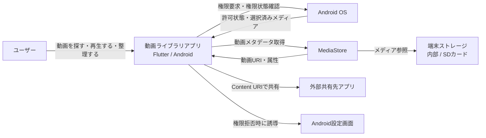
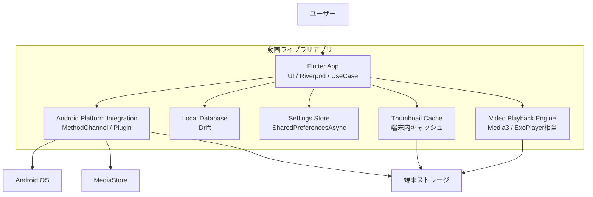
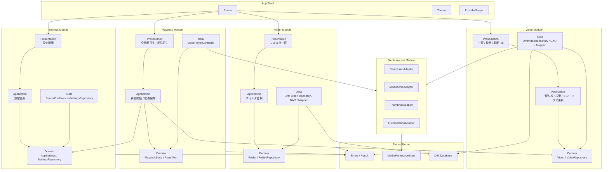
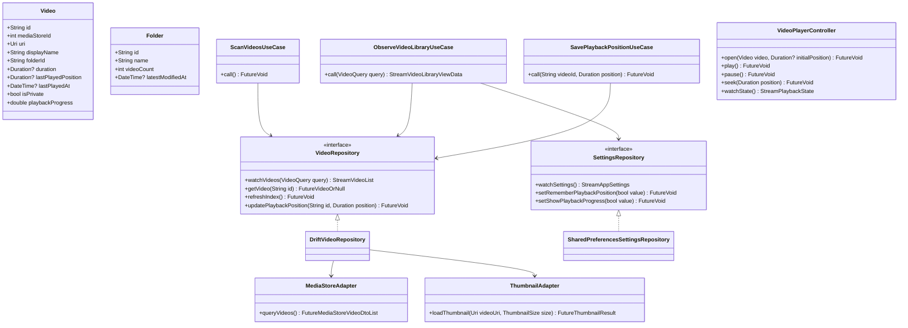
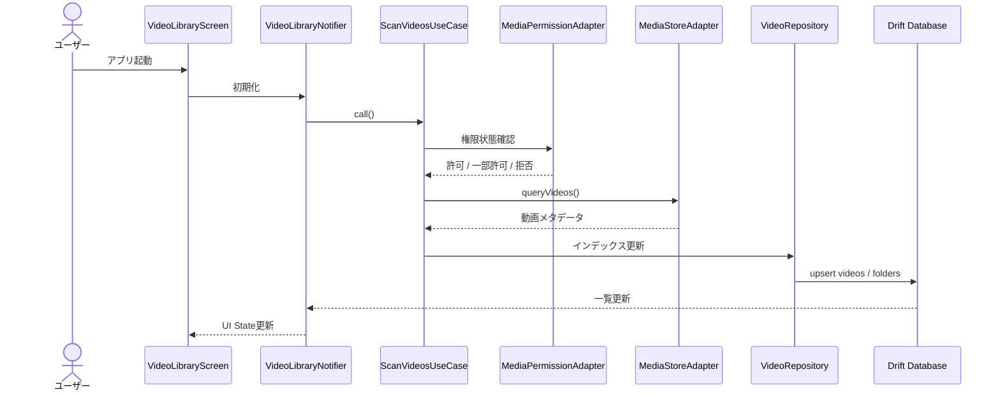
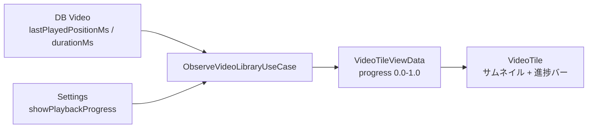
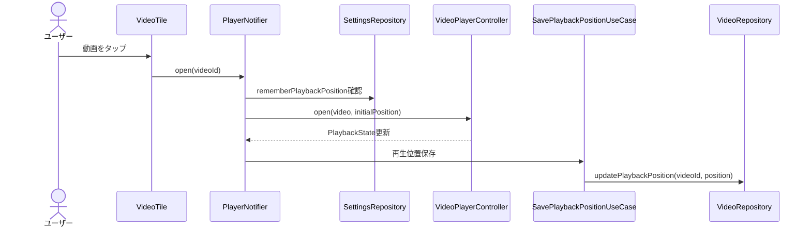

# 動画ライブラリアプリ 設計書

## 1. 概要

この設計書は、端末内動画を一覧・検索・整理・再生するAndroid向け動画ライブラリアプリを、Flutter/Dartで実装するためのアーキテクチャ方針を定義する。

上位入力は `要件定義書/要件定義書.md` とする。特に、権限管理、MediaStoreからの動画検出、ローカルインデックス、動画一覧、検索、フォルダ表示、サムネイル、再生位置保存、サムネイル上の視聴進捗バー、設定保存を設計対象に含める。

### 1.1 目的

本書の目的は、実装前にシステム全体の境界、主要コンポーネント、コード配置を揃えることである。これにより、UI、ドメインロジック、永続化、Android固有処理が混ざらない構造で開発を進められる。

### 1.2 対象読者

対象読者は、本アプリを実装するFlutterエンジニア、Android連携部分を実装するエンジニア、設計レビューを行う開発者である。Flutterの基本、Riverpod、非同期処理、AndroidのMediaStoreの概要を理解している前提とする。

### 1.3 前提技術

| 領域 | 採用方針 |
| --- | --- |
| アプリ | Flutter / Dart |
| 状態管理・DI | Riverpod |
| アーキテクチャ | Modular Monolith + Clean Architecture |
| ローカルDB | Drift |
| 設定保存 | SharedPreferencesAsync |
| Android連携 | Flutter plugin / MethodChannel |
| 動画取得 | Android MediaStore |
| サムネイル取得 | `ContentResolver.loadThumbnail` 相当 |
| 動画再生 | Flutter UI + Android Media3 / ExoPlayer 相当 |

### 1.4 設計原則

- UIは状態を表示し、ユーザー操作をイベントとしてUseCaseへ渡す。
- Domain層はFlutter、Android、DB、MethodChannelに依存しない。
- 動画、フォルダ、再生、設定、メディアアクセスなどのドメインごとにモジュールを分ける。
- 各モジュールは `domain`、`application`、`data`、`presentation` を内部に持ち、関連コードを近くに置く。
- Android固有処理は `platform` 層に閉じ込める。
- 永続化はRepository経由で扱い、UIからDriftやSharedPreferencesAsyncを直接参照しない。
- 再生位置は動画単位で保存し、一覧では視聴進捗バーとして表示できるようにする。

## 2. C4 Level 1: System Context

本アプリは、Android端末内の動画を扱うローカルファーストなアプリである。外部サーバーへユーザーの動画を送信しない。



### 2.1 外部システム

| 外部システム | 役割 |
| --- | --- |
| Android OS | 権限管理、ライフサイクル、Intent、画面回転、認証を提供する。 |
| MediaStore | 端末内動画のメタデータとContent URIを提供する。 |
| 端末ストレージ | 実際の動画ファイルとサムネイル元データを保持する。 |
| 外部共有先アプリ | ユーザーが選択した動画を共有する受け手になる。 |
| Android設定画面 | 権限拒否または一部許可時の設定変更先になる。 |

## 3. C4 Level 2: Container

アプリ内部は、Flutter UI、Android連携、ローカルDB、設定保存、サムネイルキャッシュ、動画再生エンジンに分ける。



### 3.1 Container責務

| Container | 責務 |
| --- | --- |
| Flutter App | 画面、状態管理、UseCase呼び出し、ルーティングを担当する。 |
| Android Platform Integration | MediaStore、権限、サムネイル、ファイル操作などAndroid固有APIを呼び出す。 |
| Local Database | 動画インデックス、フォルダ情報、再生位置、最終再生日を保持する。 |
| Settings Store | 表示形式、並び替え、再生位置保存、視聴進捗バー表示などの設定を保持する。 |
| Thumbnail Cache | 一覧表示用サムネイルをキャッシュし、スクロール性能を守る。 |
| Video Playback Engine | 動画再生、一時停止、シーク、早送り、巻き戻し、再生位置通知を担当する。 |

## 4. C4 Level 3: Component

Flutter App内は、ドメインごとのモジュールで分割する。各モジュールは内部にPresentation、Application、Domain、Dataを持ち、モジュール外へはRiverpod provider、UseCase、Repository interfaceなどの明示的な公開面だけを見せる。



### 4.1 モジュール責務

| モジュール | 主な責務 |
| --- | --- |
| `video` | 動画一覧、検索、並び替え、サムネイル、視聴進捗バー、動画インデックスを扱う。 |
| `folder` | フォルダ一覧、フォルダ内動画、代表サムネイルを扱う。 |
| `playback` | 全画面再生、簡易再生、再生状態、シーク、再生位置保存を扱う。 |
| `settings` | 表示形式、並び替え、再生位置保存、視聴進捗バー表示設定を扱う。 |
| `media_access` | 権限、MediaStore、サムネイル取得、ファイル操作などAndroid連携を扱う。 |
| `shared` | エラー、Result、DB接続、横断的な値オブジェクトを扱う。 |

### 4.2 主要コンポーネント

| コンポーネント | モジュール | 責務 |
| --- | --- | --- |
| `VideoLibraryScreen` | `video` | 動画一覧、検索、並び替え、表示形式切り替えを表示する。 |
| `VideoTile` | `video` | サムネイル、タイトル、再生時間、視聴進捗バーを表示する。 |
| `VideoLibraryNotifier` | `video` | 一覧画面の状態とイベントを管理する。 |
| `ScanVideosUseCase` | `video` | 権限確認後、MediaStoreから動画を取得しDBへ反映する。 |
| `ObserveVideoLibraryUseCase` | `video` | DBと設定を組み合わせ、一覧表示用モデルを返す。 |
| `SavePlaybackPositionUseCase` | `playback` | 再生位置と最終再生日を保存する。 |
| `VideoRepository` | `video` | 動画一覧、検索、詳細、再生位置更新の抽象インターフェース。 |
| `FolderRepository` | `folder` | フォルダ一覧とフォルダ内動画の抽象インターフェース。 |
| `SettingsRepository` | `settings` | 表示設定、並び替え、進捗バー表示設定を扱う。 |
| `MediaStoreAdapter` | `media_access` | Android MediaStoreから動画メタデータを取得する。 |
| `ThumbnailAdapter` | `media_access` | `ContentResolver.loadThumbnail` 相当の処理を呼び出す。 |
| `VideoPlayerController` | `playback` | 再生状態、シーク、終了時の位置通知を扱う。 |

## 5. C4 Level 4: Code

Level 4では、実装時に作成する代表的な型と依存方向を定義する。ここに書く型名は初期実装の基準であり、実装中に責務が大きくなった場合は機能単位で分割する。



### 5.1 Entity

`Video` はMediaStore由来の属性とアプリ内状態を統合したドメインモデルである。`lastPlayedPosition` と `duration` が存在する場合、`playbackProgress` は `lastPlayedPosition / duration` で算出する。再生完了に近い動画は、実装時に「進捗バーを100%表示するか、位置をリセットするか」をUseCase側で明示する。

`Folder` はフォルダ一覧とフォルダ内一覧の表示単位である。フォルダ代表サムネイルは、Data層で代表動画を決めてUI表示モデルへ変換する。

### 5.2 Repository

Repository interfaceは各モジュールの `domain` に置き、DB、MediaStore、MethodChannelに依存しない。Repository implementationは同じモジュールの `data` に置き、Drift DAO、Platform Adapter、Mapperを組み合わせる。別モジュールから利用する場合は、実装クラスではなく公開ProviderまたはUseCaseを経由する。

### 5.3 ViewModel

Riverpod NotifierはPresentation層に置く。NotifierはUseCaseだけに依存し、DAOやMethodChannelを直接呼ばない。画面ごとに `AsyncValue` または明示的なUI Stateを使い、権限未許可、空状態、読み込み中、エラー状態を表現する。

## 6. ディレクトリ構成

基本方針は、`lib/src/modules` 配下にドメイン単位のモジュールを置くモジュラモノリス構成とする。各モジュールは内部に `domain`、`application`、`data`、`presentation` を持ち、変更理由が近いファイルを同じ境界内にまとめる。

```text
lib/
  main.dart
  src/
    app/
      app.dart
      router.dart
      theme.dart
      providers.dart
    shared/
      errors/
        app_exception.dart
        failure.dart
      result/
        result.dart
      permissions/
        media_permission_state.dart
      database/
        app_database.dart
      utils/
        duration_format.dart
    modules/
      video/
        domain/
          video.dart
          video_query.dart
          video_repository.dart
        application/
          scan_videos_use_case.dart
          observe_video_library_use_case.dart
          search_videos_use_case.dart
        data/
          tables/
            videos_table.dart
          daos/
            video_dao.dart
          repositories/
            drift_video_repository.dart
          mappers/
            video_mapper.dart
        presentation/
          video_library_screen.dart
          video_library_notifier.dart
          video_library_state.dart
          widgets/
            video_tile.dart
            playback_progress_bar.dart
            sort_menu.dart
      folder/
        domain/
          folder.dart
          folder_repository.dart
        application/
          observe_folders_use_case.dart
          observe_folder_videos_use_case.dart
        data/
          tables/
            folders_table.dart
          daos/
            folder_dao.dart
          repositories/
            drift_folder_repository.dart
          mappers/
            folder_mapper.dart
        presentation/
          folder_list_screen.dart
          folder_list_notifier.dart
          folder_list_state.dart
          widgets/
            folder_tile.dart
      playback/
        domain/
          playback_state.dart
          player_port.dart
        application/
          open_video_use_case.dart
          close_video_use_case.dart
          save_playback_position_use_case.dart
        data/
          video_player_controller.dart
        presentation/
          full_screen_player_screen.dart
          instant_player_sheet.dart
          player_notifier.dart
          player_state.dart
      settings/
        domain/
          app_settings.dart
          settings_repository.dart
        application/
          observe_settings_use_case.dart
          update_settings_use_case.dart
        data/
          shared_preferences_settings_repository.dart
        presentation/
          settings_screen.dart
          settings_notifier.dart
          settings_state.dart
      media_access/
        domain/
          media_permission.dart
          media_access_repository.dart
        data/
          media_store/
            media_store_adapter.dart
            media_store_video_dto.dart
          thumbnails/
            thumbnail_adapter.dart
            thumbnail_cache.dart
          permissions/
            media_permission_adapter.dart
          file_operations/
            file_operation_adapter.dart
test/
  modules/
    video/
    folder/
    playback/
    settings/
    media_access/
  shared/
  widget/
```

### 6.1 配置ルール

| 配置先 | 置くもの | 置かないもの |
| --- | --- | --- |
| `app` | アプリ起動、ルーティング、テーマ、ProviderScope | 個別画面のビジネスロジック |
| `shared` | 横断的な型、エラー、Result、DB接続、共通ユーティリティ | 特定モジュールだけで使うWidgetやUseCase |
| `modules/<domain>/domain` | Entity、Repository interface、ドメインルール | Flutter Widget、Drift、MethodChannel |
| `modules/<domain>/application` | UseCase、ユースケース単位の調整ロジック | 画面State、DAOの直接操作 |
| `modules/<domain>/data` | Repository実装、DAO、Mapper、DB table、Adapter | UI State、画面遷移 |
| `modules/<domain>/presentation` | 画面、Notifier、画面専用Widget | DBやMethodChannelの直接操作 |
| `modules/media_access` | Android API連携、DTO、MethodChannel | 動画一覧や再生の画面ロジック |

### 6.2 モジュール間依存ルール

- `presentation` は同一モジュールの `application` に依存する。
- `application` は同一モジュールの `domain` と、必要な他モジュールの公開UseCaseまたはRepository interfaceに依存できる。
- `data` は同一モジュールの `domain` を実装し、`shared/database` と `media_access` を利用できる。
- モジュールをまたいで `data` 実装やDAOを直接参照しない。
- 循環依存が必要になった場合は、より上位のUseCaseを新設して依存方向を整理する。

## 7. 主要データフロー

### 7.1 初回スキャン



### 7.2 一覧表示と視聴進捗バー

一覧表示では、DBの動画情報と設定情報を組み合わせて画面表示用モデルを作る。`showPlaybackProgress` が `true` で、動画に `duration` と `lastPlayedPosition` がある場合、`VideoTile` はサムネイル下部に視聴進捗バーを表示する。



### 7.3 動画再生と再生位置保存

動画を開くとき、`rememberPlaybackPosition` が `true` で保存済み位置がある場合は、その位置を初期再生位置として渡す。再生中または終了時に位置を保存し、次回の再生開始位置と一覧の視聴進捗バーに反映する。



## 8. 実装順序

1. 権限状態モデルとAndroid権限連携を作る。
2. MediaStore連携と動画DTO取得を作る。
3. Driftの動画・フォルダテーブル、DAO、Repository実装を作る。
4. 一覧画面、検索、並び替え、フォルダ表示を作る。
5. サムネイル取得とキャッシュ、サムネイル失敗時のフォールバックを作る。
6. 全画面再生と簡易再生を作る。
7. 再生位置保存と続きから再生を作る。
8. サムネイル上の視聴進捗バーを作る。
9. 共有、削除、移動、コピー、名前変更などのファイル操作を作る。
10. プライベート化、認証、詳細画面、タグ表示を拡張する。

## 9. テスト方針

| 対象 | テスト内容 |
| --- | --- |
| Domain | `Video.playbackProgress`、検索条件、並び替え条件、進捗算出を単体テストする。 |
| UseCase | 権限状態ごとのスキャン、再生位置保存、設定反映をテストする。 |
| Data | Drift DAO、Repository mapping、差分更新、削除済み動画の扱いをテストする。 |
| Platform | MethodChannelはFake実装で、MediaStore DTOと権限状態の変換をテストする。 |
| Widget | 動画一覧、空状態、権限拒否、サムネイル失敗、視聴進捗バー表示をテストする。 |

Flutterの初期実装では、DomainとUseCaseのテストを先に用意する。Android実機依存のMediaStore、サムネイル、再生エンジンはAdapterを抽象化し、Dart側ではFakeで検証する。

## 10. 要件対応表

| 要件 | 設計上の対応 |
| --- | --- |
| 権限管理 | `MediaPermissionAdapter` と権限用UI Stateで扱う。 |
| 動画検出・インデックス作成 | `ScanVideosUseCase`、`MediaStoreAdapter`、Drift DBで扱う。 |
| 動画一覧表示 | `VideoLibraryScreen`、`VideoLibraryNotifier`、`ObserveVideoLibraryUseCase`で扱う。 |
| サムネイル表示 | `ThumbnailAdapter`、`ThumbnailCache`、`VideoTile`で扱う。 |
| 視聴進捗バー | `lastPlayedPosition`、`showPlaybackProgress`、`PlaybackProgressBar`で扱う。 |
| 検索・並び替え | `VideoQuery` と `SearchVideosUseCase` で扱う。 |
| フォルダ表示 | `FolderRepository`、`FolderTile`、フォルダ用クエリで扱う。 |
| 全画面再生・簡易再生 | `playback` モジュールと `VideoPlayerController` で扱う。 |
| 再生位置保存 | `SavePlaybackPositionUseCase` と `VideoRepository.updatePlaybackPosition` で扱う。 |
| 設定保存 | `SettingsRepository` と SharedPreferencesAsync実装で扱う。 |

## 11. 補足

iOSディレクトリはFlutterプロジェクト上に存在するが、本アプリの要件はAndroid向けである。そのため、本設計書ではAndroid連携を主対象にする。将来iOS対応を行う場合は、`platform` 層にiOS Adapterを追加し、DomainとPresentationの再利用範囲を維持する。
